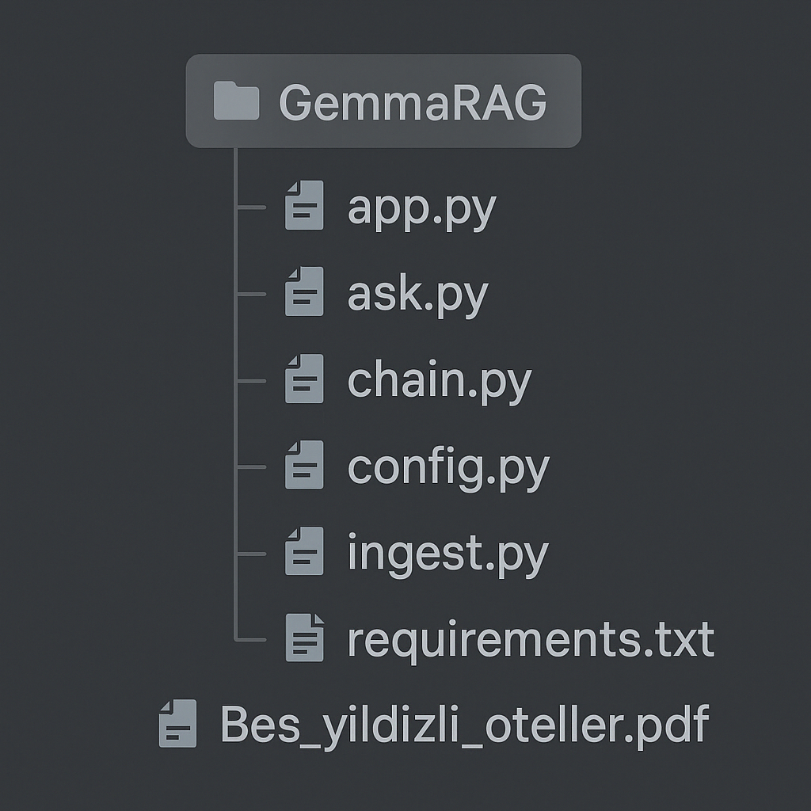

# 🏨 GemmaRAG - Otel Bilgi Asistanı

Bu proje, PDF formatındaki otel verileri üzerinden **Gemma 2 LLM** ile çalışan yerel bir **RAG (Retrieval-Augmented Generation)** sistemidir. Kullanıcılar oteller hakkında doğal dilde sorular sorabilir ve sistem, PDF içeriğine dayalı yanıtlar verir.

## 🚀 Özellikler

- ✅ Yerel çalışan LLM (Gemma 2 2B) ile entegre
- ✅ HuggingFace sentence-transformers ile embedding
- ✅ FAISS vektör veritabanı kullanımı
- ✅ PDF içeriklerinden bilgi çekme
- ✅ Komut satırı (CLI) ve Streamlit arayüz desteği

## 🧩 Kullanılan Teknolojiler

- Python
- LangChain
- FAISS
- Ollama
- Streamlit
- Sentence-Transformers
- PyPDFLoader

## 📂 Dosya Yapısı

